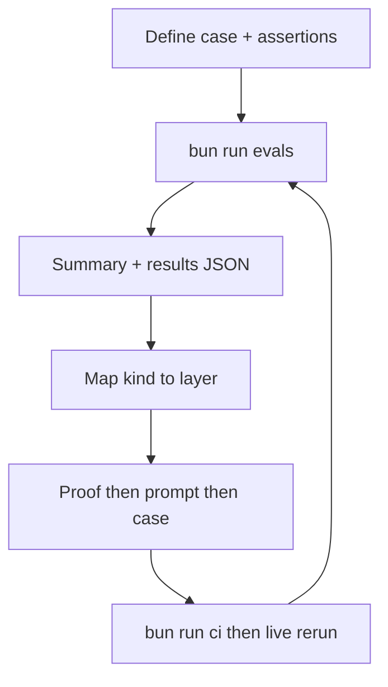

# AI agent coding guidelines

This document serves as the authoritative behavioral and stylistic manual for
all AI Agents writing code in this repository.

## Domain model and core glossary

This glossary standardizes the core vocabulary used across the eval harness and
its interaction with `@worlds/client`:

### Seeded world

An in-memory LibSQL-backed graph populated with deterministic RDF fixture data
for eval execution. Each eval case receives a fresh seeded world instance.

### Fixture

A seeded world factory that produces a `Client` with a known RDF graph. The
primary fixture contains work, protagonist, and house entities. The scholar
fixture contains paper, author, venue, and year entities.

### Eval case

A single evaluation scenario defined by an id, description, prompt, maximum step
budget, and a declarative `assertions` list (`AssertionSpec[]` in
[`src/cases/index.ts`](src/cases/index.ts)). Cases exercise specific agent
behaviors like search-then-SPARQL handoff, SPARQL guard enforcement, or
distractor disambiguation.

### Assertion

A deterministic code-level check applied to an eval result. Each case wires
named assertion specs;
[`src/assertions/assertion-registry.ts`](src/assertions/assertion-registry.ts)
implements a small set of composable kinds (`handoff-valid`, `output-excludes`,
`literals-subset-of-tools`, etc.). Prefer proofs over new assertion code (see
Evaluation policy).

### Assertion spec

A declarative entry `{ name, kind, ...params }` on an eval case. The `name` is
stable for `--trials` and `--compare` pass-rate aggregation; the `kind` selects
the registry implementation.

### Tool sequence

The ordered list of tool calls made by the agent during an eval case. The
expected pattern is `searchWorld` followed by `executeSparql`.

## Evaluation policy

Prefer **proofs** (zero eval code) over **tests** (minimal composable code):

| Layer            | Proof (prefer)                                                    | Test (when needed)                                        |
| :--------------- | :---------------------------------------------------------------- | :-------------------------------------------------------- |
| `@worlds/client` | Patch sync, typed `SearchResult`, chunk projection                | —                                                         |
| Tool boundary    | [`isReadOnlySparqlQuery`](src/tools/is-read-only-sparql-query.ts) | `updates-blocked` observes guard fired                    |
| Agent contract   | Tool descriptions, `promptTemplate`, system prompt                | Registry kinds on trajectory                              |
| New regression   | Extend tool description or client invariant first                 | Reuse existing `AssertionSpec` kind; add case wiring only |

When adding a test assertion: one registry `kind`, rich failure `message` (tool
sequence, allowlist preview, first offending literal). Do not add per-case
assertion functions or LLM judges. Natural-language / hybrid retrieval cases
stay deferred until protocol assertions are stable.

**Upstream:** index freshness and co-store invariants belong in
`@worlds/client`, not duplicated in this harness.

**CI on push and pull request:**
[`.github/workflows/ci.yml`](.github/workflows/ci.yml) runs `bun run ci` only
(format, lint, unit tests). It does not call Gemini. Live agent evals run via
[`.github/workflows/evals.yml`](.github/workflows/evals.yml) on manual dispatch
or the weekly schedule when `GOOGLE_GENERATIVE_AI_API_KEY` is configured.

**Epistemic closure:** `literals-subset-of-tools` scans
[`TRACKED_FIXTURE_LITERALS`](src/fixtures/tracked-fixture-literals.ts). Add new
fixture answer strings there;
[`tests/fixtures/tracked-fixture-literals.test.ts`](tests/fixtures/tracked-fixture-literals.test.ts)
fails if any canonical fixture string is missing from the list.

## Eval iteration

Eval-driven development here means encoding desired agent outcomes as eval cases
and assertion specs, running live Gemini trials against seeded worlds, and
tightening prompts or proofs until pass rates stabilize. Deterministic assertions
are the pass/fail gate (see Evaluation policy above). Trajectories in
`results/*.json` are evidence for diagnosis; they are not committed to this
repository.

### Closed loop

1. **Define** the outcome in [`src/cases/index.ts`](src/cases/index.ts):
   `promptTemplate`, `assertions`, optional `fixtureId`, and `maxSteps`.
2. **Run** live evals: `bun run evals` with `--filter`, `--trials`, or
   `--compare`. See [README.md](README.md) for CLI examples under Tool
   configuration iteration.
3. **Observe** the terminal summary and `results/latest.json` (per-case output,
   assertion lines, `metadata.trajectory`). With `--trials`, also read
   `results/stats-latest.json` for per-case and per-assertion pass rates.
4. **Diagnose** using the failing assertion `kind`, its `message`, and the tool
   sequence in the trajectory.
5. **Fix** the smallest layer that applies: proof (guard, tool description,
   client invariant) before prompt text, case wiring before a new registry
   `kind`.
6. **Verify** with `bun run ci` (golden trajectories in
   [`src/cases/test-fixtures.ts`](src/cases/test-fixtures.ts)), then re-run the
   filtered live case.

### What you optimize

| Layer | Location |
| :---- | :------- |
| System prompt | [`src/runner/eval-agent-system-prompt.ts`](src/runner/eval-agent-system-prompt.ts) |
| Per-case scenario | [`src/cases/index.ts`](src/cases/index.ts) `promptTemplate` |
| Tool descriptions | [`src/tools/agent-tool-descriptions.ts`](src/tools/agent-tool-descriptions.ts) |
| Stricter tool discipline | [`src/tool-configs/`](src/tool-configs/) `systemPromptAdditions` |
| Discovery/query placeholders | [`src/tool-configs/index.ts`](src/tool-configs/index.ts) (`{{discovery}}`, `{{query}}`) |

### Finding gaps

Add or tune a case when:

- Dogfooding surfaces a repeatable failure (wrong handoff, invented literal,
  tool loop, guard bypass attempt).
- A new fixture graph path needs coverage (`fixtureId` in
  [`src/fixtures/index.ts`](src/fixtures/index.ts)).
- A credentialed baseline run (see Agent evals CI below) regresses on a named
  assertion.

| Goal | Typical flags |
| :--- | :------------ |
| Iterate on one hypothesis | `--filter <case-id>` |
| Measure stability | `--trials N --min-pass-rate <0-1>` |
| Compare prompt or tool configs | `--compare baseline,strict-eval` |

Incomplete, rate-limited, or credential-skipped live runs are operational signals
only; do not cite them as benchmark evidence.

### Reading failures

| Assertion kind | Behavior exercised | Typical prompt lever |
| :------------- | :----------------- | :------------------- |
| `used-required-tools` | Both discovery and query tools called | System prompt; case instructions to use `{{discovery}}` and `{{query}}` |
| `search-before-sparql` | Discovery before query in tool sequence | Case ordering text; system prompt tool order |
| `sparql-handoff-valid` | Subject URI from search appears in first SPARQL args | Case handoff steps; system “use subject from search” |
| `step-count-bounded` | Step budget respected | Case “fewest tool calls”; stricter tool config |
| `updates-blocked` | Mutating SPARQL triggers read-only guard | Usually code ([`is-read-only-sparql-query.ts`](src/tools/is-read-only-sparql-query.ts)), not wording |
| `final-answer-contains` | Final text includes expected literal | Case “exact literal only”; system “do not paraphrase” |
| `output-excludes` | Final text must not include a literal | Case disambiguation or “say not found” |
| `sparql-answer-grounded` | Literal appears in SPARQL bindings | Ensures answer came from query, not guess |
| `sparql-answer-excludes` | Literal absent from bindings | OPTIONAL or absent-data scenarios |
| `literals-subset-of-tools` | No tracked fixture strings without tool evidence | Case “do not guess”; epistemic closure allowlist |

Registry implementations and failure messages live in
[`src/assertions/assertion-registry.ts`](src/assertions/assertion-registry.ts).

### Choosing a fix

Use the Evaluation policy table as the default decision guide:

- **Prompt or agent contract** when protocol assertions fail (`used-required-tools`,
  `search-before-sparql`, `sparql-handoff-valid`) but tool outputs look correct;
  when `sparql-answer-grounded` passes but `final-answer-contains` fails
  (paraphrase); or when the same assertion flakes across `--trials` (discipline).
- **Code or harness** when `updates-blocked` fails (guard or error substring);
  or when trajectory reducers mis-parse otherwise valid tool results.
- **Upstream (`@worlds/client` or fixture)** when `sparql-handoff-valid` fails with
  empty discovered subjects despite a reasonable search query; or when search/SPARQL
  result shapes change.
- **Case wiring only** when the scenario is new but an existing `kind` already
  expresses the invariant—add an `id` and `assertions` in
  [`src/cases/index.ts`](src/cases/index.ts) without a new registry kind.
- **New registry `kind`** only when no composable kind fits; one kind, rich
  failure `message`, wire cases in the catalog.

### Worked example

Case `search-miss-unknown-label` encodes epistemic discipline when discovery finds
no subject for an unknown work label:

- **Prompt** instructs calling `{{discovery}}` with the unknown label, using
  `{{query}}` only if a URI is returned, and saying the fact was not found
  otherwise.
- **Assertions** `output-excludes` (must not emit the seeded house literal) and
  `literals-subset-of-tools` (no tracked fixture strings without tool evidence).
- **System prompt** reinforces “say not found instead of guessing” in
  [`eval-agent-system-prompt.ts`](src/runner/eval-agent-system-prompt.ts).

Iterate with `bun run evals --filter search-miss-unknown-label`, inspect the
trajectory for a spurious `executeSparql` or invented literal in output, tighten
wording if needed, then run `--trials 10` before widening the filter.

### Iteration habits

- Change **one case per hypothesis**; use `--filter` until it passes, then run a
  broader slice.
- Keep assertion **`name` fields stable** so `--trials` and `--compare` aggregate
  pass rates meaningfully.
- Extend **proofs** (tool descriptions, guard, client invariants) before adding
  registry kinds or per-case assertion logic.
- When adding a new canonical answer string to a fixture, update
  [`TRACKED_FIXTURE_LITERALS`](src/fixtures/tracked-fixture-literals.ts) so
  `literals-subset-of-tools` and its unit test stay accurate.

## Agent evals CI and artifacts

The [Agent evals](.github/workflows/evals.yml) workflow is the credentialed
baseline runner. After each live run it uploads `results/*.json` as a workflow
artifact and publishes a best-effort GitHub Discussion in the `Evals` category
when that category exists. Generated trajectories are not committed to this
repository.

The workflow job may exit non-zero when assertions or pass-rate gates fail even
though the results artifact was uploaded. Treat assertion results as the health
signal; artifacts are trajectory evidence only.

Repository prerequisite: GitHub Discussions must be enabled with a dedicated
category named `Evals`. If the category is missing, artifact upload still works
and discussion publication is skipped with a warning.

## Declarative clarity and naming conventions

To preserve maximum maintenance legibility, prioritize expressive semantics over
mathematical brevity.

- **Zero cryptic abbreviations:** Never utilize ambiguous or single-syllable
  variable shorthand. Always expand abstractions into their descriptive
  counterparts.
  - Avoid: `rs`, `res`, `req`, `cnt`, `q`, `err`
  - Prefer: `resultSet`, `response`, `request`, `count`, `query`, `error`
  - **Conflict avoidance:** Evade naming collisions via intuitive descriptive
    prefixes or suffixes (e.g., `storedCount`, `processedQuad`).

- **Direct file-symbol alignment:** The name of source files must strictly match
  the dominant exported symbol using lowercase kebab-case identifiers.
  - Example: `EvalCaseResult` MUST live in `eval-case-result.ts` or be grouped
    in a domain module like `types.ts`.

- **Deterministic prefixes:** Use active verb modifiers when establishing
  asynchronous action boundaries (e.g., `fetchData`, `persistState`).

- **Explicit JSDoc semantics:** JSDoc comments for all structural symbols
  (functions, interfaces, properties, methods) MUST begin directly with the
  symbol's exact name and form a complete, descriptive sentence.
  - Good:
    `/** EvalCaseResult stores the output and assertion results for one scenario. */`
  - Bad: `/** The result of running an eval. */`
  - Corrected:
    `/** EvalCaseResult stores the output and assertion results for one scenario. */`

## Documentation aesthetics and markdown conventions

To ensure visual continuity and ease of navigation across all repository
documentation files:

- **Uniform sentence-case headings:** All markdown headings must be clear,
  concise, and exclusively use sentence casing. Do not use decorative emojis in
  any markdown headings.
  - Avoid: `## Quick Capabilities`, `### Available Examples`
  - Prefer: `## Key capabilities`, `### Available examples`
- **Non-numbered structural boundaries:** Do not include numeric prefixes in
  markdown headings. Let the physical document outline establish hierarchy
  naturally.
  - Avoid: `### 4. AI SDK agent (Gemini + tools)`
  - Prefer: `### AI SDK agent`
- **Suppression of horizontal rules:** Avoid utilizing `---` divider lines to
  segment documents. Let empty lines establish boundaries cleanly.

## Development constraints and CI hygiene

To maintain a healthy local development lifecycle and ensure perfect
green-passing integration pipeline runs:

- **Unix line endings (LF) enforcement:** All files in the repository MUST use
  standard Unix line endings (`LF` / `\n`). The use of Windows line endings
  (`CRLF` / `\r\n`) is strictly prohibited. You MUST run `bun run fmt` before
  staging any changes to auto-format text line endings and keep the CI formatter
  checks green.

- **Environment variables:** Any execution task requiring remote endpoints or
  API tokens must load `.env` (for example `bun --env-file=.env run evals` or
  the `evals` npm script, which loads `.env` automatically).

- **npm lifecycle scripts:** `@worlds/client` pulls TensorFlow-related npm
  packages with optional lifecycle scripts. Run `bun install` after dependency
  updates (CI does this before `bun run ci` and live evals) so installs match
  local development.

- **Test-driven execution boundaries:** Always run local tests with
  `bun run ci` or `bun test` to verify that all code compiles, formats, and
  passes operational invariants without errors prior to opening pull requests.

- **Live eval quota awareness:** The eval harness calls the Google Gemini API.
  Free-tier quotas are limited (500 RPD, 15 RPM). Use `--filter <case>` for
  local debugging to avoid spending full-suite quota. Treat rate-limited runs as
  operational signals only, not benchmark evidence.
